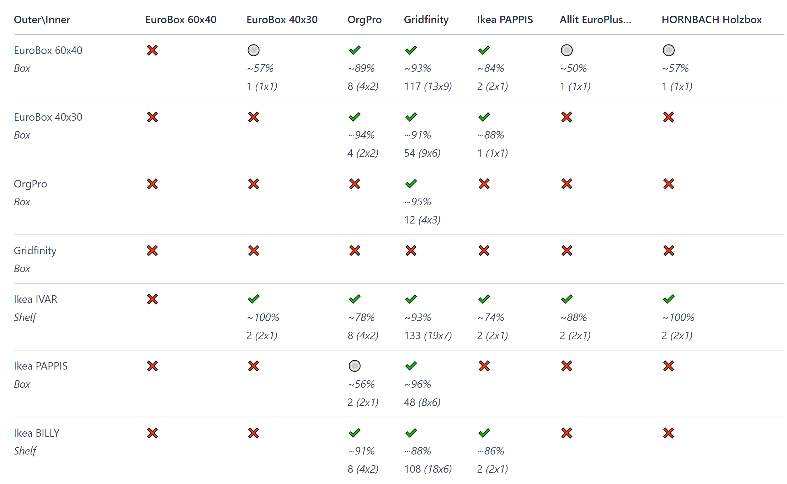

# Box Compatibility Project

The Box Compatibility Project aims to collect and analyze data on various types of boxes, focusing on their compatibility with different storage systems. This README file provides an overview of the project and its objectives.

## Project Overview

The goal of the Box Compatibility Project is to create a comprehensive database of boxes, along with their dimensions, features, and compatibility information with different storage systems such as shelves, cabinets, and containers. By gathering this data, we aim to assist individuals and businesses in finding the most suitable boxes for their storage needs and ensuring efficient utilization of space.

The results can be viewed [here](https://orglikea.pro/tools/box-compatibility/) or rendered by the script (see "Rendering the Data").

*Example table*


## Adding a New Box

To contribute to the Box Compatibility Project and add a new box to the database, please follow these steps:

1. Open the `data.json` file in the repository.
2. Add the information of the new box in the following format:
   ```json
   {
      "name": "Box Name",
      "vendor": "Vendor Name",
      "type": "Box Type: Container or Shelf",
      "link": "Link to More Information",
      "inner_x": 57,
      "inner_y": 37,
      "outer_x": 60,
      "outer_y": 40
   }

3. Replace the values with the appropriate information for the new box.
4. Ensure the dimensions (`inner_x`, `inner_y`, `outer_x`, `outer_y`) are accurate and in the appropriate units.
5. Save the changes to the `data.json` file.
6. Submit a merge request with your changes.

Once your contribution is accepted and merged, the new box and its compatibility information will be added to the project's database.

## Rendering the Data

To render the box compatibility data into HTML or Markdown format, you can use the `render.py` script provided in the repository. Follow the steps below:

1. Make sure you have Python installed on your machine.

2. Open a terminal or command prompt and navigate to the project's directory.

3. Run the `render.py` script with the desired parameters. By default it would render the `data.json` to markdown as `output.md`. If you like you can change the behavior for example to render the data into HTML format, use the following command:

```python render.py --format html --output output.html```


4. The script will process the data and generate the output file in the specified format (HTML or Markdown).

You can now open the rendered file using a web browser or text editor to view the formatted box compatibility information.

## License

The Box Compatibility Project is released under the [MIT License](LICENSE.md). By contributing to this project, you agree to grant the project maintainers the right to distribute your contributions under this license.
